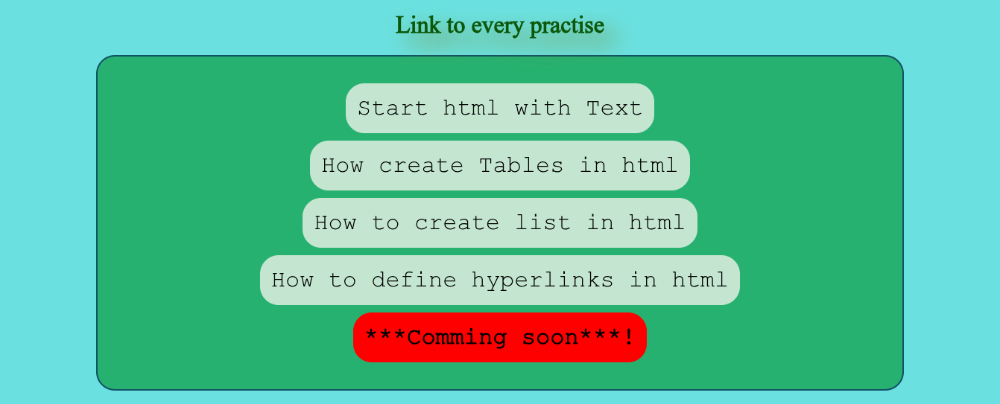

# Web Journey

## 🌐 Live Demo

https://abbaskargozar.github.io/Web-Journey/

This repository contains my collection of practice projects built while learning **HTML, CSS, and JavaScript**.

The exercises follow my personal learning roadmap, starting with the fundamentals and gradually moving toward more advanced topics. By the end of this journey, I plan to build and publish several frontend projects here.

Using **GitHub Pages**, I have made this repository live, and I will continue adding each new exercise as I complete it.

The current `index.html` is intentionally simple and works as a navigation page for all projects. As the repository grows, I may redesign it, but for now I like its clean, list-style appearance.

[] (https://abbaskargozar.github.io/Web-Journey/)

